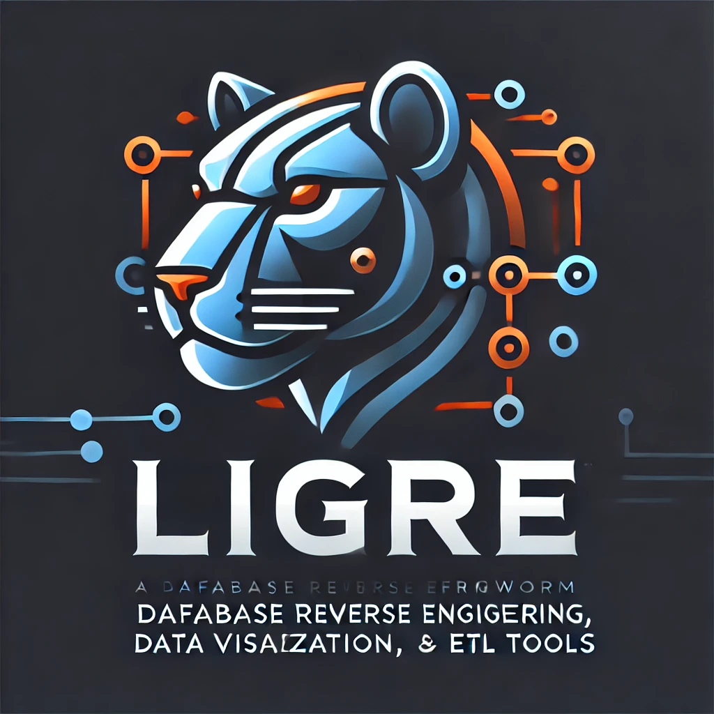

# LIGRE - **L**ightweight **I**ntegration & **G**rid-based **R**eversal **E**ngine

- **Lightweight** → Rápido e eficiente
- **Integration** → Conexão com vários bancos de dados
- **Grid-based** → Exibe dados em grids, CRUDS e gráficos
- **Reversal** → Engenharia reversa de banco de dados
- **Engine** → Um motor poderoso para análise

Framework que será em escrito para 2 linguagens, Python e PHP

Faz engenharia reversa de vários tipos bancos de dados e facilmente mostra grid, crud, gráficos, relatórios etc

Com autenticação, webserver, logs, ferramentas de ETL e muito mais.
